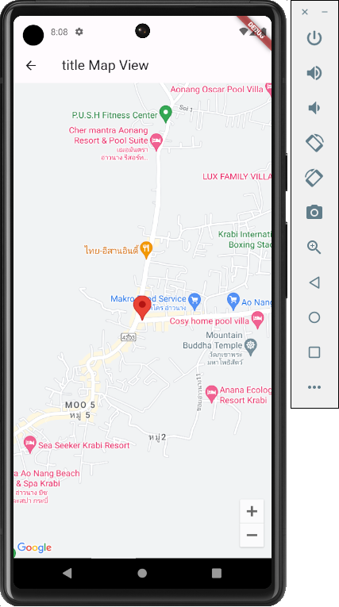

# Travel Diary App

This is the part of subject  "ITCS424-Wireless and mobile Computing" Mahidol university.

## Description

We want to make a travel diary app because people love to remember their trips, but current apps don't capture the personal side of travel well. We aim to create a user-friendly digital space where users can easily record their travel moments, making it more enjoyable and memorable.

## Images of the app

- Loading page
  - 
- Home page
  - 
- Drawer
  - 
- Sign up page
  - 
- Forgot password
  - 
- Sign in page
  - 
- Destination page
  - 
- Map page
  - 
- Add new destination page
  - 
- Edit destination page
  - 
- Calendar page
  - 
- Settting page
  - 

## Members

- Mister Nattapong Mumklang 6388092
- Mister Kontawat Wisetpaitoon 6388154
- Mister Kittipich Aiumbhornsin 6488004
- Mister Pattaravit Suksri 6488089
- Mister Linfeng Zhang 6488168
